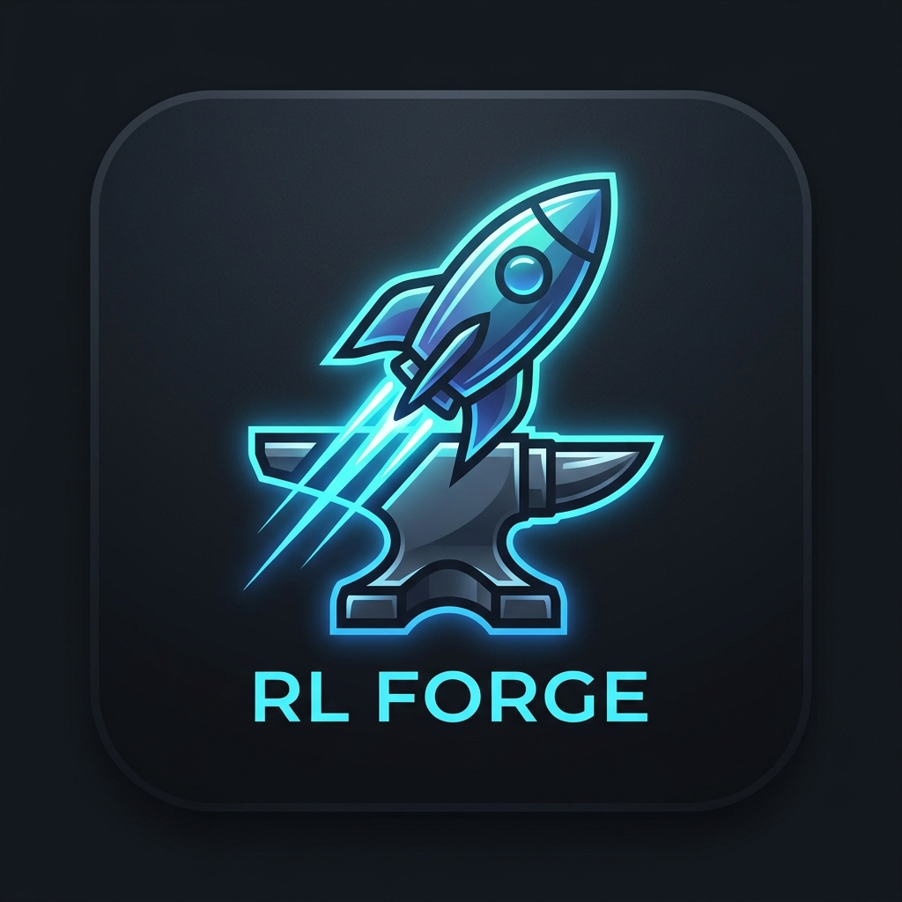

<h1 align="center">
  <br>
  🚀 RL Forge
</h1>

<p align="center">
  <strong>A modern, fast, and secure local cosmetic swapper for Rocket League.</strong>
</p>

<p align="center">
  
  
</p>

## 📖 About

**Developed by [TheDroid](https://github.com/TheDroidBR)**, RL Forge is a native Windows desktop application built to simplify local cosmetic modding in Rocket League. It replaces local item models with the ones you want without the need for complex command-line tools. 

RL Forge uses a completely custom dark-mode GUI built in Python, while securely using the community-trusted `RLUPKTool` engine under the hood to ensure game stability.

### ✨ Features
- **Modern UI:** Built with CustomTkinter for a premium dark mode experience.
- **Smart Search:** Real-time item filtering with thumbnail previews.
- **Favorites & Combos:** Save your favorite items or create full presets (Combos) to swap multiple items with a single click.
- **Native Auto-Update:** Seamless, silent self-updating mechanism right inside the app. No need to manually download new zips.
- **Safe & Reversible:** Easy "Restore All" button to revert to the original unmodded game files at any time.

## 📥 Installation & Usage

1. Go to the **[Releases](https://github.com/TheDroidBR/RL-Forge/releases/latest)** tab.
2. Download the latest `RLForge.exe`.
3. Put the `.exe` anywhere on your computer (like your Desktop) and run it.
4. Point the app to your Rocket League `CookedPCConsole` folder (the app usually auto-detects it).
5. Select the item you have, the item you want, and click **⚡ SWAP**.

## 🛠️ Building from Source

If you want to compile the `.exe` yourself:
```bash
pip install -r requirements.txt
python build.py
```
*Note: Make sure `RLUPKTool.exe` is present in the root directory before building.*

## 🙏 Credits & Acknowledgments

This project is made possible thanks to the open-source modding community:
* **[ShinyEmii (Toga)](https://github.com/ShinyEmii/Toga-Files):** Providing the incredibly maintained database of item IDs, packages, and AES keys.
* **[AltimorTASDK](https://github.com/AltimorTASDK/RLUPKTool):** For creating the `RLUPKTool` engine that powers the safe UPK decryption/encryption.

## 🔒 Privacy & Metrics

To help improve the software and track adoption, RL Forge collects anonymous usage metrics:
- **Unique Users:** An anonymous hash based on your machine ID to count total installations.
- **Active Users:** A periodic heartbeat while the app is open to track concurrent users.
- **No Personal Data:** We do not collect names, emails, IPs (beyond standard web request logs), or any game-sensitive data.

## ⚖️ Disclaimer & License

*RL Forge is an open-source project distributed under the **GNU GPL v3.0 License**.*
*This tool is **NOT** affiliated with, endorsed, or sponsored by Psyonix, Epic Games, or any of their partners. Local cosmetic modding is done at your own risk.*
